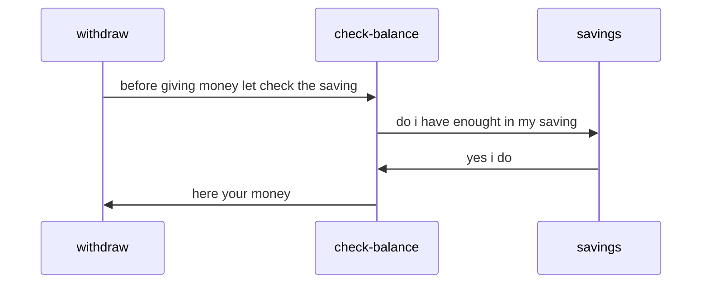
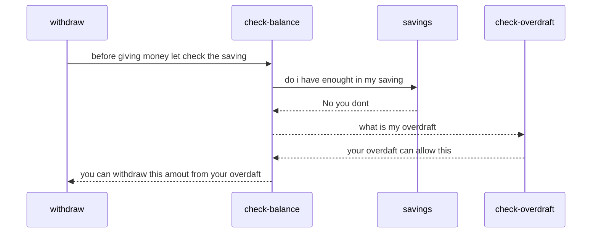
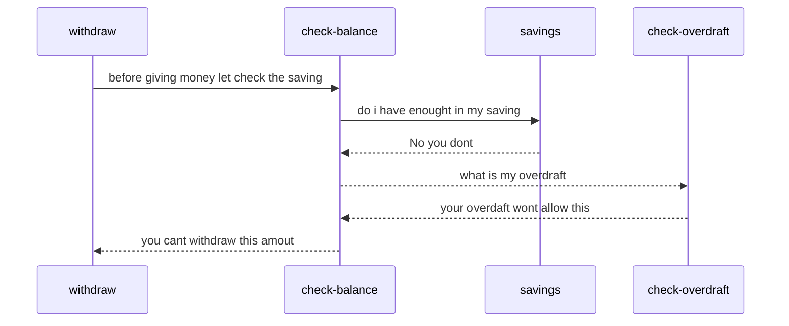

# interview-assessment

## ATM machine

  

We all know how ATM machines work… don’t we? You are tasked with developing software for one that:

  

- should initialize with the following accounts: Account Number PIN Opening Balance Overdraft

  

123456789 1234 800 200

  

987654321 4321 1230 150

  

- should initialize with €1500 made up of 10 x €50s, 30 x €20s, 30 x €10s and 20 x €5s

  

- should not dispense funds if the pin is incorrect,

  

- cannot dispense more money than it holds,

  

- cannot dispense more funds than customer have access to

  

- should not expose the customer balance if the pin is incorrect,

  

- should only dispense the exact amounts requested,

  

- should dispense the minimum number of notes per withdrawal,

  

The application should receive the data, process the operations and then output the results, it is responsible for validating customer account details and performing basic operations as described by API requirements:

  

- User (assume any rest client – curl, postman, browser) should be able to request a balance check along with maximum withdrawal amount (if any),

  

- User should be able to request a withdrawal. If successful—details of the notes that would be dispensed along with remaining balance,

  

- If anything goes wrong, user should receive a meaningful message, and there should be no changes in user’s account,

  

Assume the application will be distributed as Docker image. Provide Dockerfile, but don’t waste too much time for building and testing docker image, focus on functionality.

  

**Assume importance levels:**

1 – Code working as described in requirements,

2 – Application is building with simple javac, mvn install or gradle build command (or any basic build command working on behalf of programming language you choose),

3 - Unit tests are included. Coverage level depends on time you have left to complete the assignment, but we would like to see business logic (service layer) coverage at 60%,

4 – Other things you would like to implement for this project (ex. Database, application test coverage over 90%, API for gathering different statistics, UI or whatever else you think would make your application extraordinary),

  
  

***Assessment***

  

Treat this as a **real project.** It should be readable, maintainable, and extensible where

  

appropriate. The implementation should preferably be in Java, however any language can be used.

  

**Where to be Start:** 
Please create a branch using your email address as the name of the branch  

then take a look a swagger file to get ideal of the APIs, and its responses 

there is already a docker file and a h2 database included 

**Flow**

## UML diagrams

* if client has saving to withdraw

* if client doesnot  saving to withdraw but do have overdraft

* if client does not  saving to withdraw or overdraft
